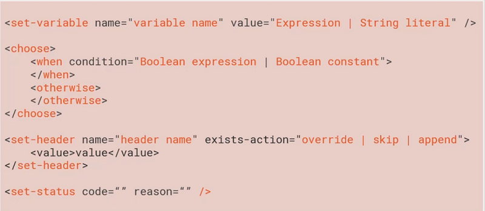
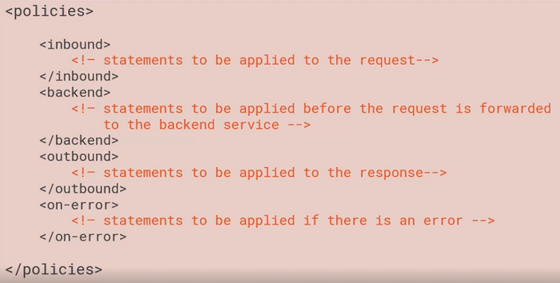

## What is API management?

> API management allows you to make that API shareable with others, make it more secure, and above all, make it more manageable.

## Why API Management

> 1. Think, of it as a facade on top of your existing API.
> 2. The documentation, the discoverability, the API console is only one facet of what API management provides.
> 3. It can provide response caching, it can secure your API.
> 4. We Also Have Insights.

### Azure API management is comprised of three different things.

1. **Proxy**
2. **Publisher Portal**

   - Here you go in to create your API management project, define your APIs, define how they will be exposed through a notion called products.
   - Analytics is also here.

3. **Developer Portal**

   - Face API portal, all of the documentation, all of the samples, the API console were all powered by developer portal.
   - It can be customized, and developer portal has the capability of templates.

   

### We have Policies in our APIM

1. Policies essentially are a bunch of statements
2. The first one is a statement that is adding a variable to the context.
3. The second one is a choose command, very similar to the switch statement in C#,
4. the set-header statement, which adds a header to an incoming request.
5. You can also specify kinds of actions, if the header is already there, do you want to skip it, do you want to append it
6. Finally you have the set-status policy statement that allows you to set the HTTP status code of your request.

> We have a Context variable in Policy file, which is basically a read only presentation of the incoming request.

### Policy Configuration

> Policy expressions are well-formed, C# 6. 0 expressions. The only requirement is that every code path ends in a return statement. Furthermore, each expression can have access to something called a context, and this context provides information about incoming requests.

