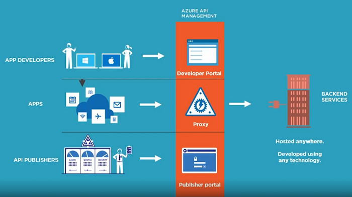

## what is API management?

> API management allows you to make that API shareable with others, make it more secure, and above all, make it more manageable.

## Why API Management

> 1. Think, of it as a facade on top of your existing API.
> 2. The documentation, the discoverability, the API console is only one facet of what API management provides.
> 3. It can provide response caching, it can secure your API.
> 4. We Also Have Insights.

### Azure API management is comprised of three different things. 
1. Proxy.
2. Publisher portal
    - Here you go in to create your API management project, define your APIs, define how they will be exposed through a notion called products.
    - Analytics is also here.

3. Developer portal
    - Face API portal, all of the documentation, all of the samples, the API console were all powered by developer portal. 
    - It can be customized, and developer portal has the capability of templates.

    